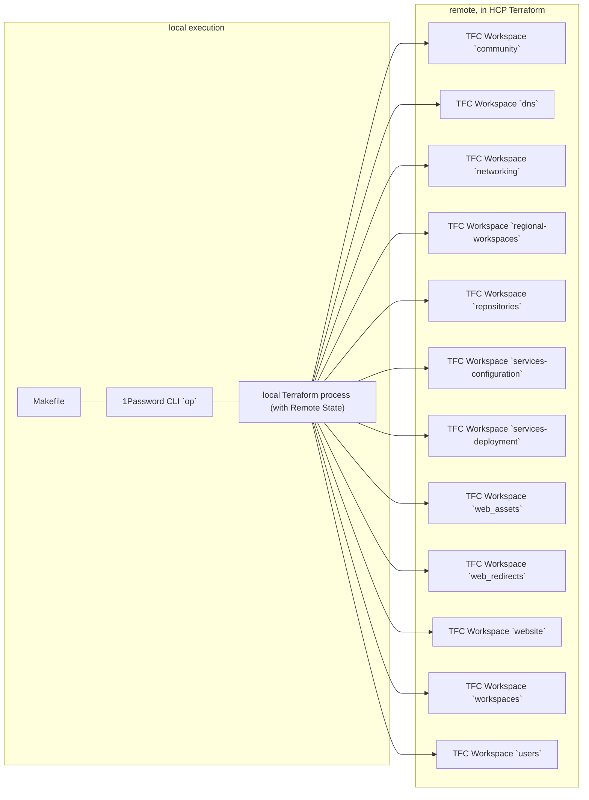

# HCP Terraform Workspace `workspaces`

> This repository manages HCP Terraform Workspaces for [@workloads](https://github.com/workloads).

## Table of Contents

<!-- TOC -->
* [HCP Terraform Workspace `workspaces`](#hcp-terraform-workspace-workspaces)
  * [Table of Contents](#table-of-contents)
  * [Requirements](#requirements)
    * [Development](#development)
  * [Diagrams](#diagrams)
    * [HCP Terraform Workspace Structure](#hcp-terraform-workspace-structure)
  * [Usage](#usage)
    * [Inputs](#inputs)
    * [Outputs](#outputs)
  * [Notes](#notes)
    * [Sensitive Data](#sensitive-data)
    * [Colorized Output](#colorized-output)
  * [Contributors](#contributors)
  * [License](#license)
<!-- TOC -->

## Requirements

* HashiCorp Cloud Platform (HCP) [Account](https://portal.cloud.hashicorp.com/sign-in)
* HashiCorp HCP Terraform [Account](https://app.terraform.io/session)
* HashiCorp Terraform `1.9.x` or [newer](https://developer.hashicorp.com/terraform/downloads)
* 1Password CLI `2.0.0` or [newer](https://1password.com/downloads/command-line/)
* a copy of [@workloads/tooling](https://github.com/workloads/tooling)

### Development

For development and testing of this repository:

* `terraform-docs` `0.17.0` or [newer](https://terraform-docs.io/user-guide/installation/)

## Diagrams

This section contains an overview of (simplified) diagrams, describing the logical connections of the individual HCP Terraform Workspaces.
All diagrams are expressed in [Mermaid](https://mermaid.js.org) syntax.

### HCP Terraform Workspace Structure

This diagram describes the [HCP Terraform Workspaces](https://developer.hashicorp.com/terraform/cloud-docs/workspaces) structure:



## Usage

The `workspaces` HCP Terraform Workspace acts as a _Seed_ Workspace. The repository provides lifecycle management of other, organization-specific HCP Terraform Workspaces and GitHub Organization configurations.

To inject sensitive _"Secret Zero"_ type data, the [1Password CLI](https://1password.com/downloads/command-line/) is used to wrap common Terraform commands (`plan`, `apply`, `destroy`).

This repository provides a [Makefile](./Makefile)-based workflow.

Running `make` without commands will print out the following help information:

```text
🟣 HCP Terraform WORKSPACES

Target          Description                                   Usage
print-secrets   print (sanitized) environment variables       `make print-secrets`
terraform       execute Terraform with a specific command     `make terraform command=plan`
import          execute a Terraform Import                    `make import local="<Terraform Resource Identifier>" remote="<Remote API identifier>"`
help            display a list of Make Targets                `make help`
_listincludes   list all included Makefiles and *.mk files    `make _listincludes`
_selfcheck      lint Makefile                                 `make _selfcheck`
```

The `terraform` target requires a command such as `plan` or `apply` and optionally supports arguments such as `-auto-approve`

<!-- BEGIN_TF_DOCS -->
### Inputs

| Name | Description | Type | Required |
|------|-------------|------|:--------:|
| auth0_client_id | Auth0 Client ID. | `string` | yes |
| auth0_client_secret | Auth0 Client Secret. | `string` | yes |
| auth0_domain | Auth0 Domain Name. | `string` | yes |
| aws_directory_admin_password | AWS Directory Service Admin Password. | `string` | yes |
| aws_directory_admin_username | AWS Directory Service Admin Username. | `string` | yes |
| datadog_api_key | Datadog API Key. | `string` | yes |
| datadog_api_url | Datadog API URL. | `string` | yes |
| datadog_api_zone | Datadog API Zone. | `string` | yes |
| datadog_app_key | Datadog App Key. | `string` | yes |
| discord_token | Discord API Token. | `string` | yes |
| docker_read_token | Docker Hub Read Token. | `string` | yes |
| docker_read_write_delete_token | Docker Hub Read / Write / Delete Token. | `string` | yes |
| docker_read_write_token | Docker Hub Read / Write Token. | `string` | yes |
| gandi_api_key | This is the Gandi API Key. | `string` | yes |
| gitguardian_token | GitGuardian Service Account Token. | `string` | yes |
| github_token | A GitHub OAuth / Personal Access Token. | `string` | yes |
| google_project_id | The Project ID to use for authenticating with GCP. | `string` | yes |
| hcp_boundary_admin_password | HCP Boundary Cluster Admin Password. | `string` | yes |
| hcp_boundary_admin_username | HCP Boundary Cluster Admin Username. | `string` | yes |
| hcp_contributor_id | HashiCorp Cloud Platform ID for `contributor` Role. | `string` | yes |
| hcp_contributor_secret | HashiCorp Cloud Platform Secret for `contributor` Role. | `string` | yes |
| hcp_viewer_id | HashiCorp Cloud Platform ID for `viewer` Role. | `string` | yes |
| hcp_viewer_secret | HashiCorp Cloud Platform Secret for `viewer` Role. | `string` | yes |
| infracost_org | Infracost Organization Identifier. | `string` | yes |
| infracost_runtask_hmac_key | HMAC Key for Infracost Run Task integration. | `string` | yes |
| infracost_runtask_url | URL for Infracost Run Task integration. | `string` | yes |
| mondoo_credential | Mondoo Credential. | `string` | yes |
| mondoo_space_id | Mondoo Space Identifier. | `string` | yes |
| okta_api_token | Okta API Token. | `string` | yes |
| okta_org_name | Okta Organization Name. | `string` | yes |
| pagerduty_key_read | PagerDuty Read-Only Key. | `string` | yes |
| pagerduty_key_readwrite | PagerDuty Read-Write Key. | `string` | yes |
| pagerduty_subdomain | PagerDuty Subdomain | `string` | yes |
| snyk_runtask_hmac_key | HMAC Key for Snyk Run Task integration. | `string` | yes |
| snyk_runtask_url | URL for Snyk Run Task integration. | `string` | yes |
| snyk_token | Snyk API Auth Token. | `string` | yes |
| tfe_oauth_client_id | VCS Provider OAuth Client Identifier. | `string` | yes |
| tfe_organization_email | Admin email address. | `string` | yes |
| csp_configuration | Project-wide List of Cloud Service Providers (CSPs). | <pre>list(object({<br>    name    = string<br>    prefix  = string<br>    enabled = bool<br>  }))</pre> | no |
| docker_username | Docker Hub Username. | `string` | no |
| gitguardian_user | GitGuardian Service Account User. | `string` | no |
| github_owner | This is the target GitHub organization or individual user account to manage. | `string` | no |
| management_region_aws | AWS-specific `Management` Region Identifier. | `string` | no |
| management_region_gcp | Google-specific `Management` Region Identifier. | `string` | no |
| project_identifier | Human-readable Project Identifier. | `string` | no |
| snyk_org | Snyk Organization Name. | `string` | no |
| tags | Object containing pre-defined Tags. | `map(string)` | no |
| tfe_organization_name | Name of the organization. | `string` | no |
| tfe_organization_owner_humans | List of Human-operated Email Addresses of HCP Terraform Organization Owners. | `list(string)` | no |
| tfe_organization_owner_robots | List of Robot-operated Email Addresses of HCP Terraform Organization Owners. | `list(string)` | no |
| tfe_organization_token_force_regenerate | Whether to forcefully regenerate and replace TFE Organization Token. | `bool` | no |
| tfe_project_names | Object containing TFE Project Names. | <pre>object({<br>    auxiliary  = string<br>    management = string<br>  })</pre> | no |
| tfe_workspace_allow_destroy_plan | Whether destroy plans can be queued on the workspace. | `bool` | no |
| tfe_workspace_auto_apply | Whether to automatically apply changes when a Terraform plan is successful. | `bool` | no |
| tfe_workspace_terraform_version | Terraform version to use for this Workspace. | `string` | no |

### Outputs

| Name | Description |
|------|-------------|
| github_urls | GitHub URLs. |
| tfe_workspace_terraform_version | Terraform version identifier of current HCP Terraform Workspace. |
| variable_set_urls | Variable Set URLs. |
| workspace_urls | Workspace URLs. |
<!-- END_TF_DOCS -->

## Notes

### Sensitive Data

Terraform state may contain [sensitive data](https://developer.hashicorp.com/terraform/language/state/sensitive-data). This workspace uses [HCP Terraform](https://developer.hashicorp.com/terraform/cloud-docs) to safely store state, and encrypt the data at rest.

### Colorized Output

Colorized CLI output may be disabled by setting the `NO_COLOR` environment variable to any non-empty value.

```shell
export NO_COLOR=1 && make
```

## Contributors

For a list of current (and past) contributors to this repository, see [GitHub](https://github.com/workloads/workspaces/graphs/contributors).

## License

Licensed under the Apache License, Version 2.0 (the "License").

You may download a copy of the License at [apache.org/licenses/LICENSE-2.0](http://www.apache.org/licenses/LICENSE-2.0).

See the License for the specific language governing permissions and limitations under the License.
