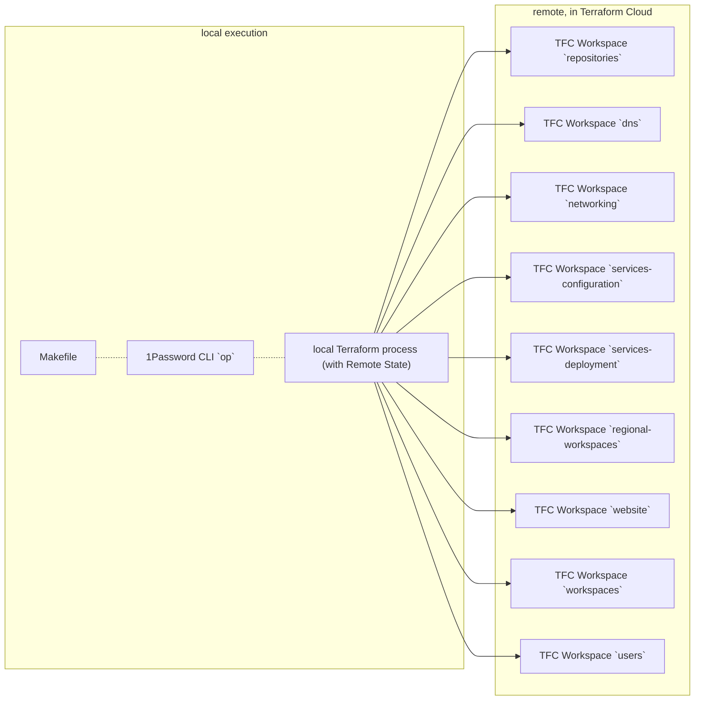

# Terraform Cloud Workspace: `workspaces`

> This directory manages the lifecycle of (other) Terraform Cloud Workspace configurations for [@workloads](https://github.com/workloads).

## Table of Contents

<!-- TOC -->
* [Terraform Cloud Workspace: `workspaces`](#terraform-cloud-workspace--workspaces)
  * [Table of Contents](#table-of-contents)
  * [Requirements](#requirements)
  * [Diagrams](#diagrams)
  * [Usage](#usage)
    * [Inputs](#inputs)
    * [Outputs](#outputs)
  * [Notes](#notes)
  * [Author Information](#author-information)
  * [License](#license)
<!-- TOC -->

## Requirements

* HashiCorp Cloud Platform (HCP) [Account](https://portal.cloud.hashicorp.com/sign-in) credentials.
* Terraform Cloud [Account](https://app.terraform.io/session)
* Terraform `1.3.0` or [newer](https://www.terraform.io/downloads).
* 1Password CLI `2.0.0` or [newer](https://1password.com/downloads/command-line/).
* (optionally) `envo` `1.0.0` or [newer](https://github.com/im2nguyen/envo).

## Diagrams

This section contains an overview of (simplified) diagrams, describing the physical connections of the _Edge Case_.
All diagrams are expressed in [Mermaid](https://mermaid.js.org) syntax.

### Terraform Cloud Workspace Structure

This diagram describes the [Terraform Cloud Workspaces](https://developer.hashicorp.com/terraform/cloud-docs/workspaces) structure:



## Usage

The `workspaces` Terraform Cloud Workspace acts as a "starter" workspace. It provides lifecycle management of other, organization-specific Terraform Cloud Workspaces and GitHub Organization configurations.

To inject sensitive _"Secret Zero"_ type data, the [1Password CLI](https://1password.com/downloads/command-line/) is used to wrap common Terraform commands (`plan`, `apply`, `destroy`).

This workflow is wrapped through a [Makefile](./Makefile). Running `make` without commands will print out a help text;

```text
help           Displays this help text
print-secrets  Prints sanitized environment variables (requires the `envo` CLI application)
terraform      Injects secrets from 1Password into a `terraform` {plan, apply, destroy, etc.} run
```

The `terraform` target requires a command such as `plan` or `apply` and optionally supports arguments such as `-auto-approve`

<!-- BEGIN_TF_DOCS -->
### Inputs

| Name | Description | Type | Required |
|------|-------------|------|:--------:|
| datadog_api_key | Datadog API Key. | `string` | yes |
| datadog_api_url | Datadog API URL. | `string` | yes |
| datadog_api_zone | Datadog API Zone. | `string` | yes |
| datadog_app_key | Datadog App Key. | `string` | yes |
| gandi_key | This is the Gandi API Key. | `string` | yes |
| gandi_sharing_id | This is the Gandi Sharing ID. | `string` | yes |
| github_owner | This is the target GitHub organization or individual user account to manage. | `string` | yes |
| github_token | A GitHub OAuth / Personal Access Token. | `string` | yes |
| hcp_boundary_admin_password | HCP Boundary Cluster Admin Password. | `string` | yes |
| hcp_boundary_admin_username | HCP Boundary Cluster Admin Username. | `string` | yes |
| hcp_contributor_id | HashiCorp Cloud Platform ID for `contributor` Role. | `string` | yes |
| hcp_contributor_secret | HashiCorp Cloud Platform Secret for `contributor` Role. | `string` | yes |
| hcp_viewer_id | HashiCorp Cloud Platform ID for `viewer` Role. | `string` | yes |
| hcp_viewer_secret | HashiCorp Cloud Platform Secret for `viewer` Role. | `string` | yes |
| infracost_org | Infracost Organization Identifier. | `string` | yes |
| infracost_runtask_hmac_key | HMAC Key for Infracost Run Task integration. | `string` | yes |
| infracost_runtask_url | URL for Infracost Run Task integration. | `string` | yes |
| snyk_org | Snyk Organization Name. | `string` | yes |
| snyk_runtask_hmac_key | HMAC Key for Snyk Run Task integration. | `string` | yes |
| snyk_runtask_url | URL for Snyk Run Task integration. | `string` | yes |
| snyk_token | Snyk API Auth Token. | `string` | yes |
| tfe_oauth_client_id | VCS Provider OAuth Client Identifier. | `string` | yes |
| tfe_organization_email | Admin email address. | `string` | yes |
| tfe_organization_name | Name of the organization. | `string` | yes |
| management_region_aws | AWS-specific `Management` Region Identifier. | `string` | no |
| project_identifier | Human-readable Project Identifier. | `string` | no |
| tags | Object containing pre-defined Tags. | `map(any)` | no |
| tfe_organization_owners | List of Email Addresses of Terraform Cloud Organization Owners. | `list(string)` | no |
| tfe_organization_token_force_regenerate | Whether to forcefully regenerate and replace TFE Organization Token. | `bool` | no |
| tfe_project_names | Object containing TFE Project Names. | <pre>object({<br>    management = string<br>  })</pre> | no |
| tfe_workspace_allow_destroy_plan | Whether destroy plans can be queued on the workspace. | `bool` | no |
| tfe_workspace_auto_apply | Whether to automatically apply changes when a Terraform plan is successful. | `bool` | no |
| tfe_workspace_terraform_version | Terraform version to use for this Workspace. | `string` | no |

### Outputs

| Name | Description |
|------|-------------|
| github_urls | GitHub URLs. |
| variable_set_urls | Variable Set URLs. |
| workspace_urls | Workspace URLs. |
<!-- END_TF_DOCS -->

## Notes

Terraform state may contain [sensitive data](https://www.terraform.io/language/state/sensitive-data). This workspaces uses [Terraform Cloud](https://www.terraform.io/cloud-docs) to safely store state, and encrypt the data at rest.

## Author Information

This module is maintained by the contributors listed on [GitHub](https://github.com/workloads/workspaces/graphs/contributors).

## License

Licensed under the Apache License, Version 2.0 (the "License").

You may obtain a copy of the License at [apache.org/licenses/LICENSE-2.0](http://www.apache.org/licenses/LICENSE-2.0).

Unless required by applicable law or agreed to in writing, software distributed under the License is distributed on an _"AS IS"_ basis, without WARRANTIES or conditions of any kind, either express or implied.

See the License for the specific language governing permissions and limitations under the License.
